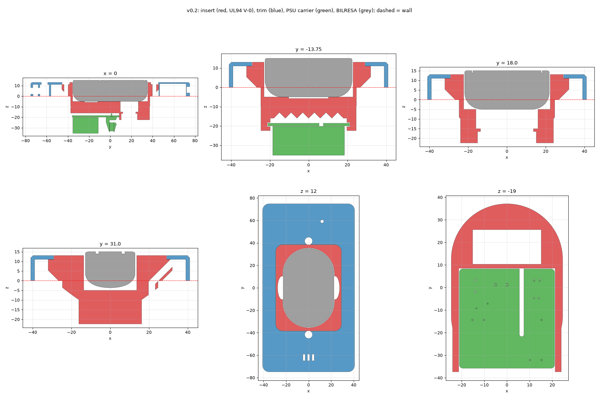
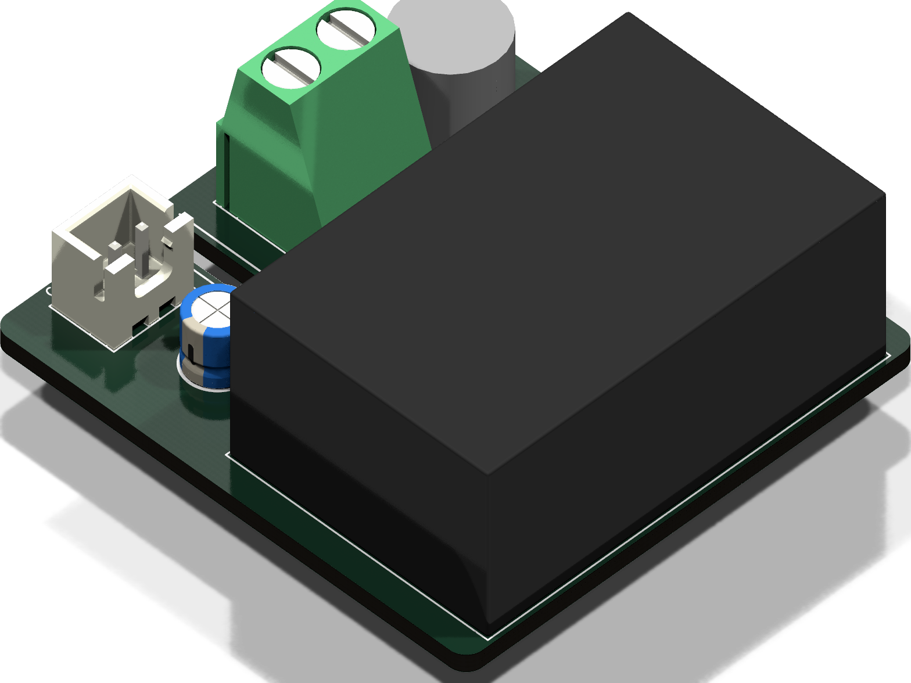
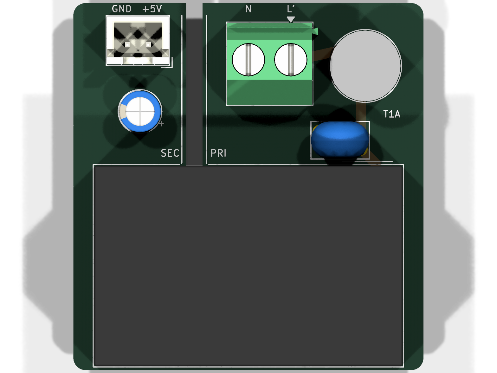
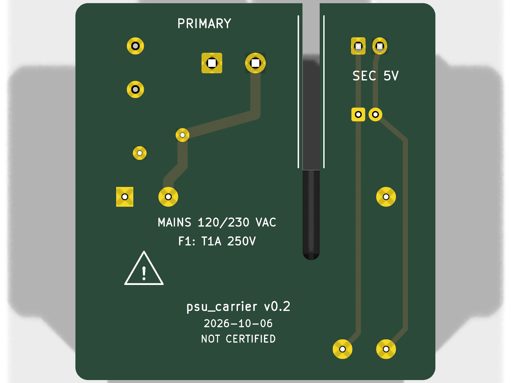
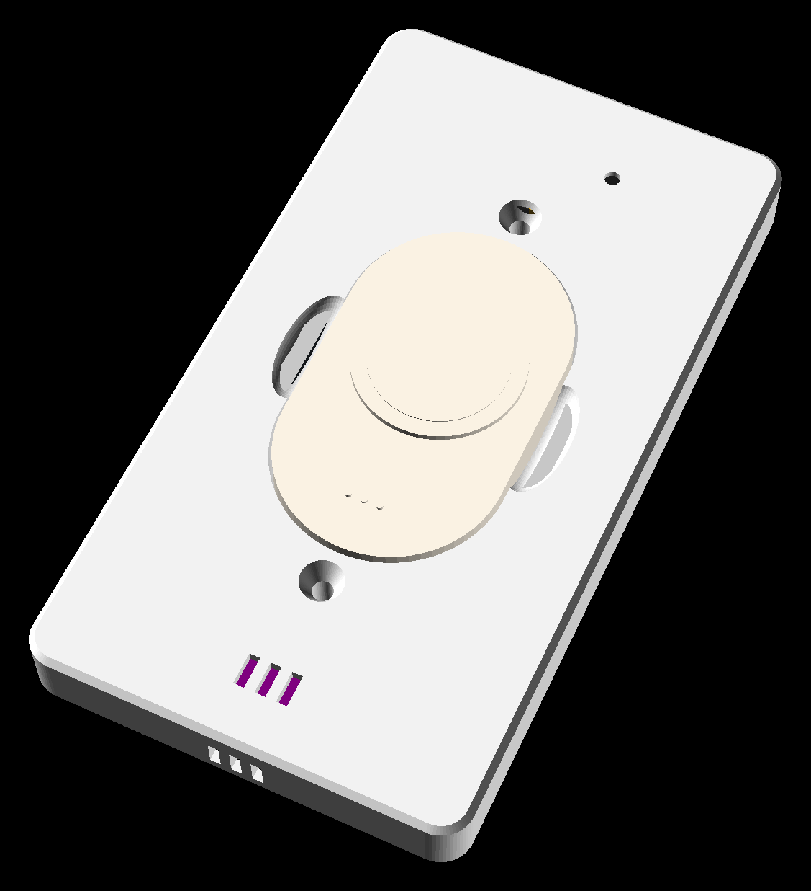
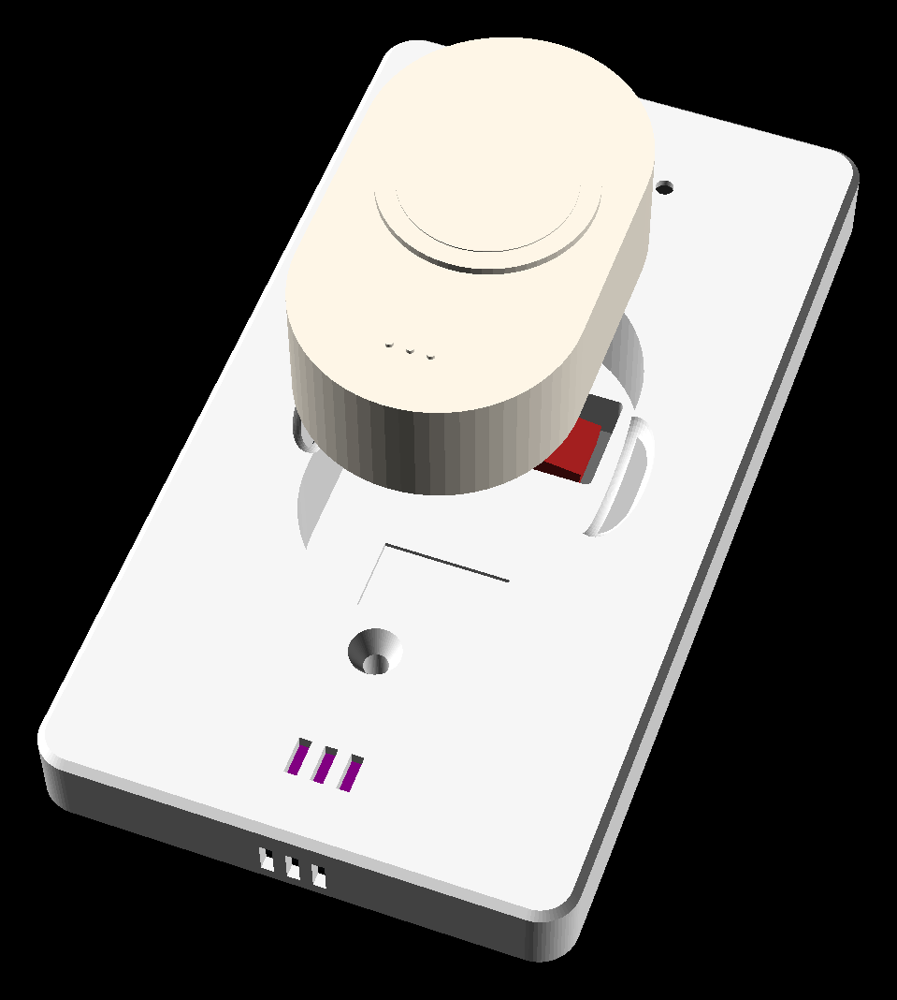
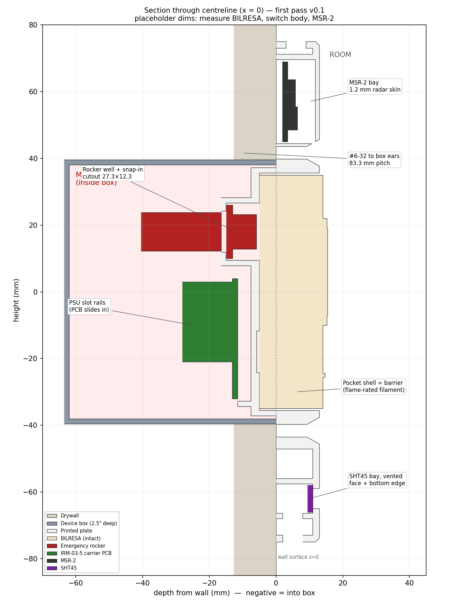
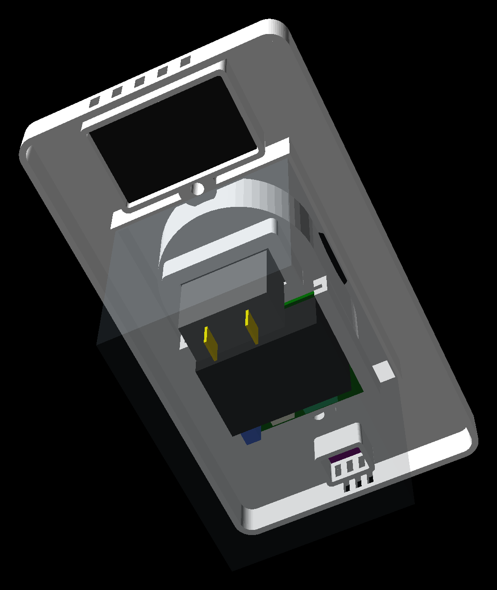
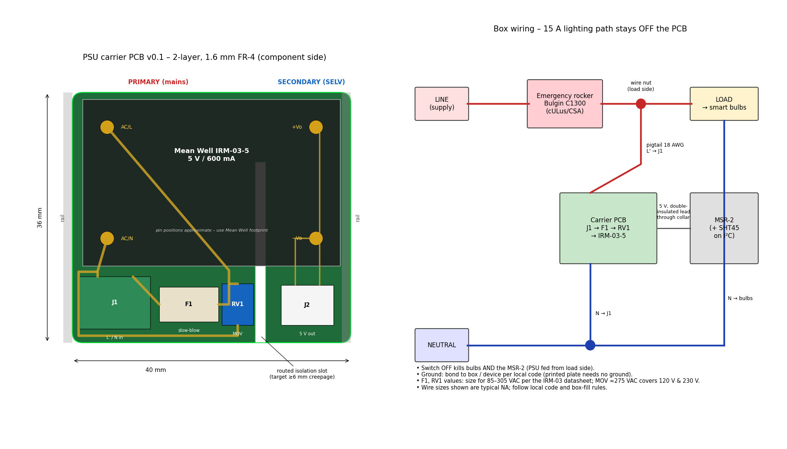

# Smart wall plate

Replacement for a single-gang light switch: recessed IKEA BILRESA remote, hidden
emergency rocker, Apollo MSR-2 mmWave presence + SHT45 climate, powered by a
Mean Well IRM-03-5 on a small carrier PCB.

Start with `AGENTS.md` (for people too), then `docs/SAFETY.md`.

v0.2 is two printed parts: a **box insert** (all mains/low-voltage barrier geometry,
UL94 V-0 PC-FR) and a **trim plate** (PETG/ASA), for an Elegoo Centauri Carbon 2.
The PSU carrier PCB is a KiCad 9 project with a PCBWay order pack.

```bash
make system-deps     # once, Ubuntu 24.04 (KiCad 9, headless slicer libs)
make setup           # once (venv + pinned OrcaSlicer)
make cad check       # CAD -> build/, all checks must pass
make print           # OrcaSlicer projects -> print/*.3mf
make pcb             # KiCad ERC/DRC + PCBWay pack -> pcb/fab/
```

Nothing here is certified or code-compliant; see `docs/SAFETY.md`.

## Renders

### v0.2

Cross-sections of the assembly: box insert (red, UL94 V-0), trim plate (blue),
PSU carrier (green). The dashed line is the wall surface. Regenerate with
`make renders`.



PSU carrier, component side, from `make pcb`:



| Top | Bottom |
| --- | --- |
|  |  |

### v0.1 concept (superseded)

Single-piece OpenSCAD plate, kept in `reference/v0.1-openscad/` for reference.

| Front | Remote lifted out |
| --- | --- |
|  |  |

| Section | Back, mains side |
| --- | --- |
|  |  |


